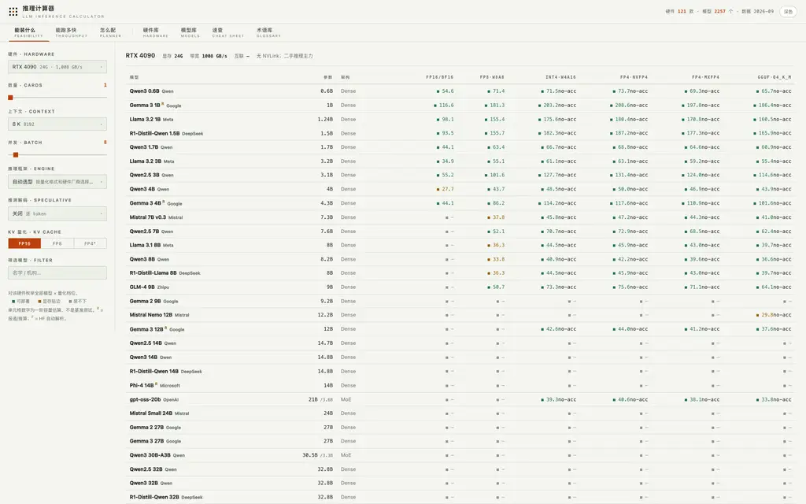
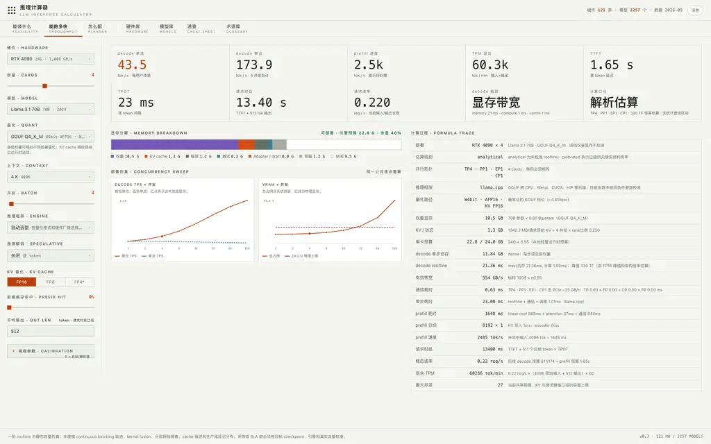
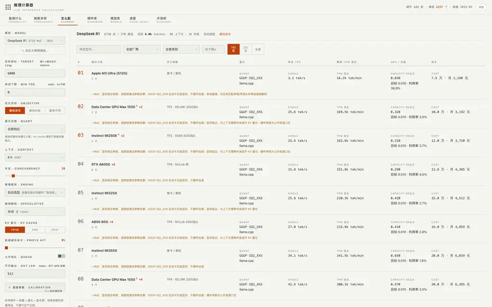

# llm-calculate

面向大语言模型推理部署的本地容量与吞吐计算器。内置 **121 款硬件**、**2,257 个模型**，覆盖显存可行性、吞吐/时延估算、部署方案搜索、硬件库、模型库、速查表和术语库。

> 这是容量规划和方案初筛工具，不是基准测试。`analytical` 与用户参数驱动的 `scenario` 均无统计置信区间；显存满足不等于部署有效，填写利用率也不构成实测校准。

## 功能

- **首页部署地图**：对照参考月成本与单流速度，直接打开低成本/高速度候选；单卡热图保留完整工作负载分桶与 P99.9 显存保护，点击单元格可带入性能页。
- **怎么配**：从已有模型或硬件出发，按真实卡数、单副本并发与目标选择处方；双目标展示 Pareto 候选，未知价格不获得成本得分。
- **能装什么**：按硬件、卡数、上下文和并发生成 FP16、FP8、INT4、FP4、MXFP4、GGUF 等显存可行性矩阵；预量化 checkpoint 只显示其实际权重格式。
- **能跑多快**：输出 decode 单流/聚合 TPS、prefill TPS、TTFT、TPOT、请求时延、req/s 和 mixed TPM，并用同一公式绘制并发吞吐与显存曲线。
- **方案库**：按目标吞吐、单流下限、成本/时延/可用性目标枚举硬件、量化、卡数和副本数；开启排队也保持单流下限约束。
- **并行与通信**：建模 TP、PP、EP 及其通信；校验 query/KV 分片与互联域。CP/DCP、未描述的跨域拓扑和聚合整柜不输出正常性能估算。
- **缓存与显存**：支持共享前缀、FP8/FP4 KV、allocator 开销、KV offload、adapter/draft、MTP 和媒体 encoder；KV 压缩只在硬件与引擎都支持时应用。
- **高级场景参数**：可填写实际权重、运行时显存、workspace、HBM/FLOPs/link 利用率、调度开销及推测解码接受 token/开销；这些输入标记为 `scenario`，不是已验证基准。
- **数据可追踪**：展示模型架构、query heads、原生/扩展上下文、参数来源、checkpoint revision、dtype 和 payload；硬件区分 matrix/vector/estimated/未知峰值。价格均为未核验参考假设，非实时报价。
- **可读界面**：中英术语、深浅主题；语言切换保留页面、模型/硬件、负载、高级参数和自定义输入。

## 截图

### 显存可行性矩阵



### 吞吐、时延与公式追踪



### 部署规划器



## 快速部署

### 环境要求

- Go 1.25 或更高版本
- 可用的本地 TCP 端口；默认 `8317`

### 直接运行

```bash
git clone https://github.com/nornzach/llm-calculate.git
cd llm-calculate
go run .
```

打开：<http://localhost:8317>

指定监听地址：

```bash
go run . -addr :9000
```

服务本身不含身份认证。仅本机使用时应监听 `127.0.0.1:8317`；对外部署时应放在带 TLS 和访问控制的反向代理后。

### 编译单文件部署

```bash
go build -trimpath -o llmcalc .
./llmcalc -addr :8317
```

`web/` 和全部 `data/` 文件均内嵌到二进制。只有 `data/models_hf.json` 与 `data/models_modelscope.json` 优先读取磁盘版本，便于刷新采集库；硬件和精选模型修改后需要重新编译。

Linux 后台运行示例：

```bash
nohup ./llmcalc -addr :8317 > llmcalc.log 2>&1 &
```

停止服务：

```bash
pkill -TERM -x llmcalc
```

## 使用方式

### 1. 首页部署地图

1. 选择模型、负载模板、目标 mixed TPM 和单副本并发。
2. 成本/速度卡片是已返回且有价格的候选中的极值，不是模型质量排名；月成本按参考采购价的 36 月摊销与假设电费计算。
3. 散点与热图使用完整分桶负载，不将长尾请求替换成平均上下文。热图只判断单卡容量，不代表达到目标 TPM。
4. 点击散点查看完整计算账本，或点击热图单元格带入性能页调参。当前模型始终置顶显示。

### 2. 能装什么

1. 选择硬件和卡数。
2. 设置上下文、并发、推理引擎、推测解码和 KV 精度。
3. 查看模型矩阵：绿色表示余量充足，黄色表示可运行但显存贴边，空白表示超过当前预算。
4. 单元格数字是当前配置下的单流 decode tok/s；`no-acc` 表示该量化只节省容量/带宽，没有对应原生低精度算力路径。
5. 可仅显示有可行量化的模型；点击可行单元格，硬件、卡数、量化、上下文和并发会一起带入性能页。不兼容的引擎不会标为可部署。

### 3. 能跑多快

1. 选择硬件、模型、权重量化，编辑输入/输出 token、请求占比、前缀命中率组成的工作负载分桶和并发。预量化 checkpoint 会自动带入并锁定原生权重格式；KV cache 精度仍独立选择。
2. 查看顶部 TPS、TTFT、TPOT、请求时延、req/s 和瓶颈类型。
3. 显存条展示权重、KV、框架、workspace、adapter/draft、系统预留和空闲空间。
4. 部署仿真分别展示 batch 变化时的聚合/单流 decode TPS 与总显存/物理上限，使用 log₂ 并发轴；当前任意 batch 都会成为曲线采样点，方案的高并发也可完整带入。右侧公式追踪列出每一步假设和分项耗时。
5. 展开“高级参数”可设置 TP/PP/EP/CP、KV offload、prefill chunk、推测接受 token/开销和其他实测校准值。
6. 负载修改后自动重算；输入无效或接口失败时隐藏过期结果，避免将旧数字当作当前结论。顶部区分显存不可行、引擎不兼容与可继续验证的配置。

结果明确返回 `support`（`supported` / `conditional` / `unsupported` / `unknown`）、`support_reason`、`estimate_valid`、`deployable`。`fit` 始终只表示显存条件；无效估算不展示速度、时延或有效吞吐，未知/不支持的组合不进入自动选型。有条件的方案仅为候选，不标为已确认部署。

HBM/FLOPs/link 利用率、调度或其他覆盖值属于用户场景假设。缺少同条件 benchmark、运行栈版本与残差评估时，不使用 `calibrated` 标签。

### 4. 怎么配

选择“我有模型”或“我有硬件”，设置单副本并发及最多两个目标。硬件方向使用填写的卡数；模型方向按目标 mixed TPM 搜索。双目标只展示返回的 Pareto 集合；处方详情和性能页始终使用该处方实际选中的模型与推理栈。各页负载独立，切换推荐模板不会覆盖其他页的输入。

### 5. 方案库

1. 选择已有模型，或录入自定义 Dense/MoE 模型结构。
2. 输入目标 mixed TPM、单流 tok/s 下限、上下文、并发和平均输出长度。
3. 选择最低成本、最低时延或最高可用目标。
4. 开启排队后，结果会显示容量 QPS、目标 QPS、利用率以及 M/M/c 平均/p95 等待时间。
5. 使用型号、厂商、类别和总卡数过滤候选方案。

M/M/c 使用泊松到达、指数服务和独立副本假设，仅用于候选比较；生产尾延迟应使用真实请求 trace 和压测验证。

### 6. 数据库、速查与术语

- **硬件库**：显存、带宽、互联、支持精度、逐精度峰值、TDP、参考价和来源；可按可见精度、类别、架构等搜索，并直接进入容量筛选。
- **模型库**：总/激活参数、attention/MoE 结构、KV 大小、上下文、checkpoint payload、原生量化和来源；支持年份、`128K` 等上下文搜索，并可带入性能试算。
- **速查**：只给出服务显存预算扣除固定 3.5 GB 后的 FP16/4-bit 权重参数预算，不含模型相关 KV 与激活，不承诺实际可部署规模。
- **术语库**：可搜索 99 项缩写、英文全称、中文解释及其对计算器公式/结果的影响。

导航支持 hash 深链接和浏览器前进/后退；页面首次打开才计算。下拉框支持方向键、Enter 选择和 Escape 关闭。

## HTTP API

页面使用的接口也可以直接调用：

| 方法 | 路径 | 用途 |
|---|---|---|
| `GET` | `/api/hardware` | 硬件列表 |
| `GET` | `/api/models` | 模型列表 |
| `GET` | `/api/quants` | 量化档位 |
| `GET` | `/api/engines` | 推理引擎 |
| `GET` | `/api/specs` | 推测解码方法 |
| `GET` | `/api/quick` | 单卡权重预算速查表 |
| `POST` | `/api/fit` | 显存可行性矩阵 |
| `POST` | `/api/perf` | 吞吐和时延估算 |
| `POST` | `/api/plan` | 部署方案枚举 |
| `POST` | `/api/recommend` | 模型/硬件方向的单目标或 Pareto 处方 |

`/api/fit` 可附带 `models`（模型 ID 数组）只计算指定模型；可附带 `workload` 使用与性能页相同的分桶计算。不提供 `workload` 时使用 `ctx` 对应的单桶、512 个输出 token。

性能估算示例：

```bash
curl -sS http://localhost:8317/api/perf \
  -H 'Content-Type: application/json' \
  -d '{
    "hw": "h100-sxm",
    "n": 1,
    "model": "llama-3.1-8b",
    "quant": "fp16",
    "workload": [{"context": 8192, "output": 512, "share": 1, "prefix_hit": 0}],
    "batch": 4,
    "eng": "auto",
    "spec": "none",
    "kvq": "fp16"
  }'
```

## 全量同步模型库

采集器同步 Hugging Face 和 ModelScope 的模型详情、架构配置、MoE 路由、上下文、dtype、许可证、发布时间及 safetensors payload。`-all` 只分页扫描内置的已核实发布机构，并覆盖文本、图文、多模态问答和音频文本等 LLM 任务，避免全站社区衍生仓库挤掉官方模型：

```bash
go run ./scripts/collect -source hf -all -min-year 2023
go run ./scripts/collect -source modelscope -all -min-year 2023
```

结果分别写入 `data/models_hf.json` 和 `data/models_modelscope.json`。同一官方范围内采用 **只增不删**：同 ID 使用新元数据更新，本次解析失败的旧条目原样保留；执行 `-all` 时会清除不在已核实发布机构列表中的自动采集条目。可用 `-orgs Qwen,deepseek-ai,...` 缩小内置已核实发布机构范围，`-refresh` 强制重拉已有条目；非内置机构不会写入默认库。

采集器按 SHA 固定 config、index 和单文件元数据读取；逻辑参数量与打包存储量分开，处理 tied embeddings、显式嵌套量化格式及 MQA。缺少证据时不再由 payload/参数量反推位宽，也不猜 GQA-8。`param_source` 区分 config、未打包逻辑计数、model_card、name 和 unknown。旧记录未经刷新不会自动获得核验标记；官方发布机构不等于所有字段已核验。

ModelScope OpenAPI 对单个发布机构查询设有 3,000 条上限；超过该上限需要按更细的发布机构范围分批同步。

当前 ModelScope 库为空。自动采集目录仍有大量未绑定 revision 或缺 encoder 几何的条目；保留其检索信息，但不把不完整输入当作已支持部署。已有来源核对和剩余边界见审计报告。

## 验证

```bash
go test ./...
node --check web/app.js
```

浏览器验证应至少覆盖：默认浅色/深色切换、原生量化锁定、显存矩阵、两张部署仿真图、并行/校准参数、KV 支持门控与 offload、自定义 MoE、规划器排队指标、术语搜索和移动端无横向溢出。

## 项目结构

```text
.
├── calc/                 # 显存、性能和规划算法
├── data/                 # 硬件、精选模型、HF / ModelScope 自动模型库
├── docs/screenshots/     # README 界面截图
├── scripts/collect/      # 双模型平台采集器
├── web/                  # 无框架前端
├── main.go               # HTTP 服务与嵌入资源
└── AUDIT_REPORT.md       # 公式、数据来源和精度边界审计
```

## 许可证

本项目采用 [MIT License](LICENSE) 授权，可自由使用、复制、修改、发布、分发、再授权及商用，但须保留原版权与许可声明。版权所有者：Zach。

## 精度边界与资料

详细公式、回归契约、已知缺口及 NVIDIA、AMD、Hugging Face、vLLM、SGLang 等一手资料见 [AUDIT_REPORT.md](AUDIT_REPORT.md)。
